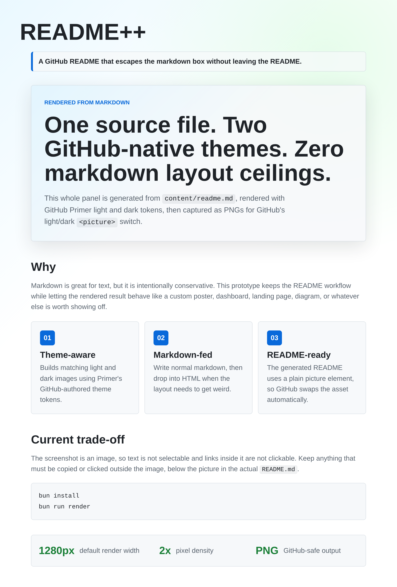

<picture>
  <source media="(prefers-color-scheme: dark)" srcset="./assets/readme-dark.png">
  <source media="(prefers-color-scheme: light)" srcset="./assets/readme-light.png">
  
</picture>

## Editing

Edit `content/readme.md`, then regenerate the README images and this wrapper:

```bash
bun run render
```

Text and links inside the image are not selectable or clickable. Put anything interactive below the image in this README.
